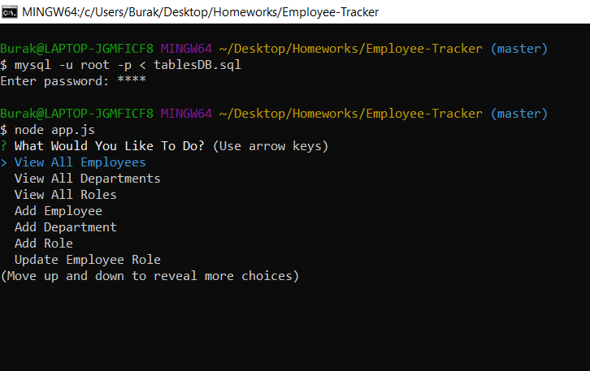

# Employee-Tracker

Manage a company's employees using node, inquirer, and MySQL.

Node command line app that lets you manage a companys employee directory including ids's, roles, departments, and managers.

- You can View all employees, roles, and departments.

- You can also add employees, roles, and departments as well as update an employees role.

**How To Use:**

    1. Clone repository

    2. Run your terminal/CMD with the path set for cloned repository folder

    3. In the terminal, run the command: npm install

    4. Log into your mysql by running: mysql -u (your username here without the parenthesis) -p <tablesDB.sql

    5. It should prompt you for your mysql password

    6. Run the command: node app.js

    7. Go through the prompts with arrow keys and select with Enter

___________________________________________________________________________________________________________________________________

